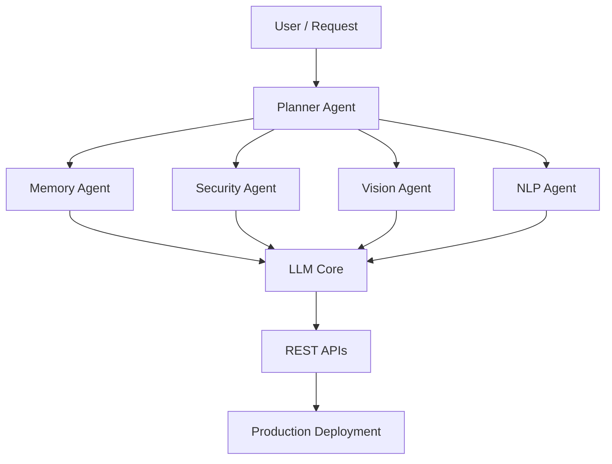

<div align="center">

```
██╗  ██╗███████╗
██║ ██╔╝██╔════╝
█████╔╝ ███████╗
██╔═██╗ ╚════██║
██║  ██╗███████║
╚═╝  ╚═╝╚══════╝
```

### Building AI that Thinks. Building Security that Learns.

</div>

<p align="center">
  
</p>

<p align="center">
  
</p>

<p align="center">
  <a href="https://linkedin.com/in/karthikeyan-s"></a>
  <a href="mailto:karthikeyan123401@gmail.com"></a>
  <a href="https://github.com/skarthi369"></a>
  
</p>

<p align="center">
  
  
  
  
</p>

---

### 🧠 About Me

- 🎓 B.Tech, **Artificial Intelligence & Data Science** — SA Engineering College, Chennai
- 🔬 **Generative AI Research Intern @ CDAC** — LLM-assisted intrusion detection & embedding-based threat intelligence
- 📄 Published Researcher — **EDITH**, ICACT 2026 International Conference (Accepted & Presented)
- 🏆 3× Hackathon Winner — Enterprise AI · Generative AI · Semantic Understanding & Fine-Tuning
- ⚙️ Full ML lifecycle: preprocessing → training → evaluation → deployment via REST APIs
- 💬 Ask me about: RAG pipelines · Agentic AI · Deepfake Detection · LLM-powered cybersecurity

---

### ⚙️ AI Command Center

```
╔═══════════════════════════════════════╗
║  AI STACK                              ║
╠═══════════════════════════════════════╣
║  LLMs / GenAI     ███████████░  95%    ║
║  Python           ████████████ 100%    ║
║  LangChain/Graph  ██████████░░  85%    ║
║  TensorFlow       █████████░░░  80%    ║
║  Computer Vision  █████████░░░  80%    ║
║  Cybersecurity AI ██████████░░  85%    ║
║  Docker           ████████░░░░  70%    ║
║  React / Node.js  ███████░░░░░  65%    ║
╚═══════════════════════════════════════╝
```

<p align="center">
  
  
  
  
  
  
  
  
  
  
  
  
</p>

---

### 🏗️ How My Agentic Systems Think



---

### 🚀 Featured Projects

<table>
<tr>
<td width="50%" valign="top">

**🛡 AI Firewall — LLM-Powered IDS/IPS**
Production-grade autonomous intrusion detection/prevention exposed via REST APIs. LLM-assisted threat classification + embedding-based semantic analysis. Containerized with Docker.
`Python` `LLMs` `Docker` `Embeddings` `REST APIs`
[View Project →](https://github.com/skarthi369)

</td>
<td width="50%" valign="top">

**🧠 MindfulChat — Emotion-Aware AI Assistant**
Privacy-first chatbot on a locally hosted LLM (Gemma) with emotion recognition, sentiment analysis, and a 5-agent architecture (Emotion, Risk, Therapy, Memory, Report).
`React` `TypeScript` `Ollama` `NLP`
[View Project →](https://github.com/skarthi369)

</td>
</tr>
<tr>
<td width="50%" valign="top">

**🎭 Deepfake Detection — CNN-Transformer Hybrid**
10-layer CNN with 653K+ parameters, ~88% validation accuracy on binary deepfake classification, extended with Transformer-based feature extraction.
`TensorFlow` `CNN` `Transformers` `OpenCV`
[View Project →](https://github.com/skarthi369)

</td>
<td width="50%" valign="top">

**🎣 Phishing URL Detection Platform**
Scikit-Learn classifiers combined with Shannon entropy analysis, redirect detection, SSL validation, and brand impersonation checks.
`Python` `Streamlit` `Scikit-Learn`
[View Project →](https://github.com/skarthi369)

</td>
</tr>
<tr>
<td width="50%" valign="top">

**🌦 Agentic Weather Prediction System**
Autonomous forecasting platform integrating LSTM, RNN, and GNN models with reinforcement learning for continuous adaptation.
`Python` `Streamlit` `LSTM` `RNN` `GNN`
[View Project →](https://github.com/skarthi369)

</td>
<td width="50%" valign="top">

**🕸 Multi-Agent AI Orchestration Framework**
Planner–executor–reviewer multi-agent workflows with dynamic routing, state management, and checkpoint recovery.
`Python` `AsyncIO` `LangGraph`
[View Project →](https://github.com/skarthi369)

</td>
</tr>
</table>

> 💡 Replace the `github.com/skarthi369` links above with your actual repo URLs, and pin these 6 on your profile.

---

### 📈 Journey

```
2024 ─── AI & Deep Learning Intern (Resolute AI) → CV pipelines, CNNs
  │
2024 ─── AI & IoT Research Intern (CED) → sensor-driven forecasting
  │
2025 ─── Microsoft x Edunet Foundations of AI → certified
  │
2025 ─── Generative AI Research Intern (CDAC) → LLM security systems
  │
2026 ─── EDITH published & presented @ ICACT 2026
  │
2026 ─── Production AI Firewall + Open Source push
```

---

<details>
<summary><b>📄 Research Publication (click to expand)</b></summary>
<br>

**EDITH — Enhanced Daily Interaction and Therapeutic Hardware for Paralysis Patient Support**
*ICACT 2026 International Conference — Accepted & Presented*

AI-assisted modular robotics platform integrating biosignal monitoring, mobility assistance, and rehabilitation support, with a designed Brain-Computer Interface (BCI) integration pathway.

</details>

<details>
<summary><b>🏆 Achievements & Certifications (click to expand)</b></summary>
<br>

- 🥇 Winner — Hexaware 36-Hour National Hackathon (Enterprise AI Track)
- 🥇 Winner — Prompt-o-Mania Hackathon (Generative AI Track)
- 🥇 Winner — Sparathon: Semantic Understanding & Fine-Tuning Challenge
- 🎖️ Foundations of Artificial Intelligence — Microsoft x Edunet Foundation x AICTE
- 🎖️ 5-Day AI Agents Intensive Course — Google & Kaggle
- 🎖️ Data Engineering Foundation Certification — Informatica
- 🎖️ Applied Generative AI Certification — Infosys Springboard
- 🎖️ Git & GitHub — Udemy

</details>

---

### 📊 Live GitHub Analytics

<p align="center">
  
  
</p>

<p align="center">
  
</p>

<p align="center">
  
</p>

<p align="center">
  
</p>

<p align="center">
  
</p>

> ⚙️ The snake animation needs a one-time GitHub Actions setup — instructions below.

---

### 🎯 Current Focus

```
NOW BUILDING     → Production AI Firewall (LLM-powered IDS/IPS)
RESEARCHING      → Agentic AI Security & Multi-Agent Orchestration
NEXT             → Distributed Multi-Agent AI Framework
OPEN SOURCING    → Reusable RAG + LangGraph agent templates
```

---

<div align="center">

```
Code. Think. Secure. Scale. Repeat.
```

</div>

---

### 📫 Let's Connect

<p align="center">
  <a href="mailto:karthikeyan123401@gmail.com"></a>
  <a href="https://linkedin.com/in/karthikeyan-s"></a>
  <a href="https://github.com/skarthi369"></a>
</p>

<p align="center">
  
</p>
