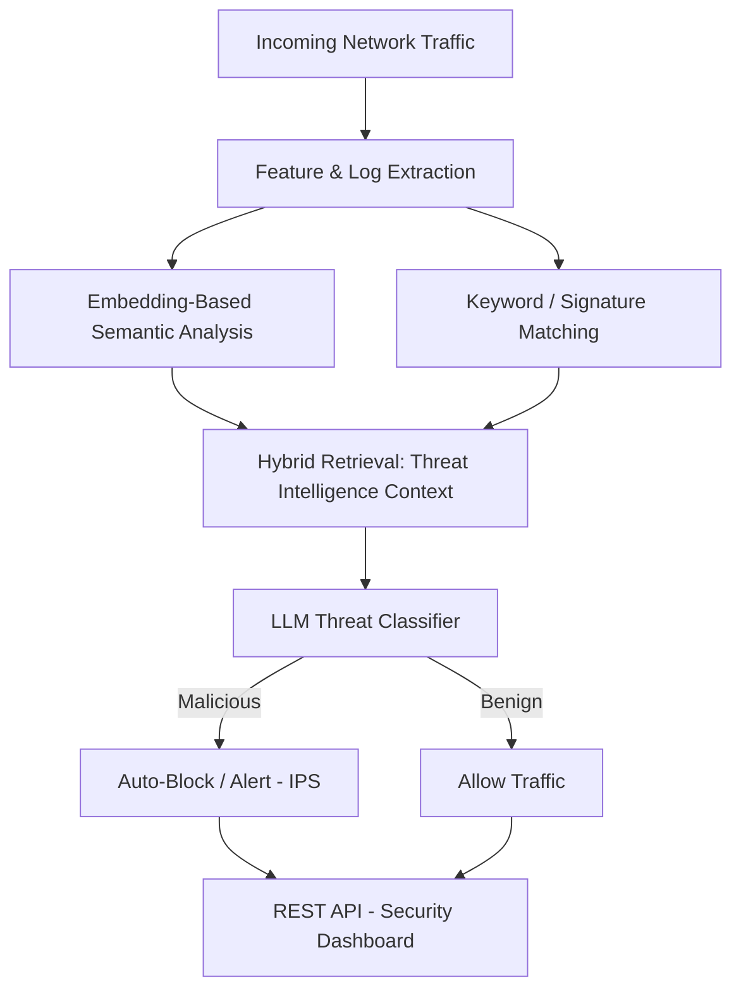

### 🧠 AI & Data Science | 🛡️ LLM Security Research @ CDAC | 🏆 3x Hackathon Winner | 📄 Published Researcher, ICACT 2026

---

## 👋 About Me

- 🎓 B.Tech in **Artificial Intelligence & Data Science**
- 🔬 Currently a **Generative AI Research Intern at CDAC**, building an LLM-powered autonomous intrusion detection & prevention system
- 🧪 Full ML lifecycle: data preprocessing → model training/evaluation → deployment via REST APIs
- 🤖 Deep into **Generative AI / LLM engineering** — RAG, Agentic AI, LangChain, LangGraph, multi-agent systems
- 🖼️ Strong in **Computer Vision & Deep Learning** — CNNs, Transformers, TensorFlow, OpenCV
- 📄 Published: *EDITH — Enhanced Daily Interaction & Therapeutic Hardware for Paralysis Patients*, ICACT 2026 (Accepted & Presented)
- 🏆 Winner — Hexaware National Hackathon, Prompt-o-Mania (GenAI), Sparathon (Semantic Understanding & Fine-Tuning)
- 📫 Open to **Python Developer / AI-ML Engineer** roles

---

## 🔧 Tech Stack

**Languages**

**AI / ML / GenAI**

**Backend / Web**

**Tools & Cloud**

---

## 🚀 Featured Projects

### 🛡️ AI Firewall — LLM-Powered IDS/IPS
**Python · LLMs · Docker · Embeddings · REST APIs · Cybersecurity AI**

Production-grade autonomous intrusion detection & prevention system exposed via REST APIs, using LLM-assisted threat classification and embedding-based semantic analysis for real-time cybersecurity decisions. Combines dense vector embeddings with keyword search in a hybrid retrieval pipeline for contextual threat intelligence. Containerized and deployed with Docker.

`[GitHub](https://github.com/skarthi369) — add repo link`

---

### 🕵️ Deepfake Detection System — CNN-Transformer Hybrid
**TensorFlow · CNN · Transformers · OpenCV · Computer Vision**

10-layer deep CNN with 653K+ parameters achieving **~88% validation accuracy** on binary deepfake classification, extended with Transformer-based feature extraction and OpenCV preprocessing for robust image analysis.

`[GitHub](https://github.com/skarthi369) — add repo link`

---

### 💬 MindfulChat — Emotion-Aware AI Mental Wellness Assistant
**React · TypeScript · Ollama · Gemma 4 · NLP**

Full-stack, privacy-first chatbot with a locally hosted LLM, featuring emotion recognition, sentiment analysis, and a 5-agent architecture (Emotion, Risk, Therapy, Memory, Report agents).

### 🎣 Phishing URL Detection Platform
**Python · Streamlit · Scikit-Learn · WHOIS · SSL Analysis**

ML-based phishing detector combining Scikit-Learn classifiers with Shannon entropy analysis, redirect detection, SSL validation, and brand impersonation checks.

### 🌦️ Agentic Weather Prediction System
**Python · Streamlit · LSTM · RNN · Graph Neural Networks**

Autonomous forecasting platform integrating LSTM, RNN, and GNN models with reinforcement learning for continuous adaptation using real-time satellite and weather-station data.

### 🧩 Multi-Agent AI Orchestration Framework
**Python · AsyncIO · LangGraph**

Planner–executor–reviewer multi-agent workflows with dynamic routing, state management, and checkpoint recovery.

> 💡 *Tip: replace the placeholder GitHub links above with your actual repo URLs once pushed.*

---

## 💼 Experience

| Role | Organization | Period |
|---|---|---|
| Generative AI Research Intern | CDAC — Centre for Development of Advanced Computing | 2025 – Present |
| AI & Deep Learning Intern | Resolute AI | 2024 |
| AI & IoT Research Intern | CED — Centre for Entrepreneurship Development | 2024 |
| Foundations of AI Intern | Microsoft × Edunet Foundation × AICTE | Apr–May 2025 |

## 📄 Research Publication

**EDITH: Enhanced Daily Interaction and Therapeutic Hardware for Paralysis Patient Support**
*ICACT 2026 International Conference — Accepted & Presented*
AI-assisted modular robotics platform integrating biosignal monitoring, mobility assistance, rehabilitation support, and a Brain-Computer Interface (BCI) integration pathway.

## 🏆 Achievements

- 🥇 Winner — Hexaware 36-Hour National Hackathon (Enterprise AI Track)
- 🥇 Winner — Prompt-o-Mania Hackathon (Generative AI Track)
- 🥇 Winner — Sparathon: Semantic Understanding & Fine-Tuning Challenge

## 📜 Certifications

- 5-Day AI Agents Intensive Course — Google & Kaggle
- Foundations of Artificial Intelligence — Microsoft & Edunet Foundation
- Data Engineering Foundation Certification — Informatica
- Git & GitHub — Udemy
- Applied Generative AI Certification — Infosys Springboard

---

## 📊 GitHub Stats

---

### 📬 Let's Connect

*Open to Python Developer & AI/ML Engineer roles — always happy to talk about LLM security, GenAI agents, or computer vision.*

