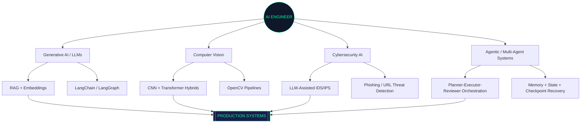
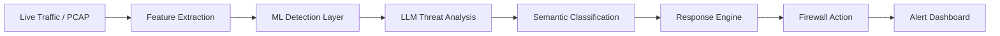
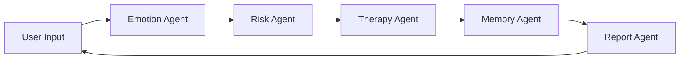
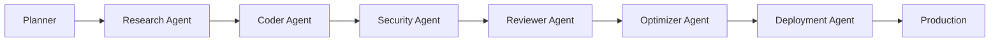
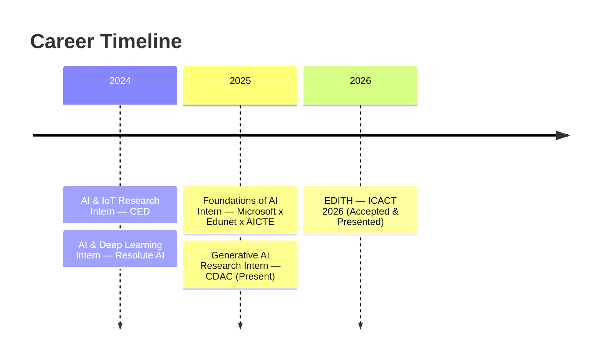

<div align="center">


<a href="https://github.com/skarthi369">

</a>

<br/>


[](https://linkedin.com/in/karthikeyan-s)
[](mailto:karthikeyan123401@gmail.com)
[](#)

</div>

<br/>

```
┌────────────────────────────────────────────────────────────────────────┐
│  root@karthikeyan:~$ whoami                                            │
│  > B.Tech AI & Data Science | 1+ yr shipping ML/DL/CV/NLP + GenAI      │
│  > Published researcher (ICACT 2026) | 3x Hackathon Winner              │
│  > Currently: Generative AI Research Intern @ CDAC                     │
└────────────────────────────────────────────────────────────────────────┘
```

<br/>

## `> help`

<div align="center">

| `about` | `mission` | `stack` | `projects` | `architecture` | `experience` | `research` | `achievements` | `contact` |
|:---:|:---:|:---:|:---:|:---:|:---:|:---:|:---:|:---:|
| [→](#-about) | [→](#-live-mission) | [→](#-tech-stack) | [→](#-projects) | [→](#-architecture-explorer) | [→](#-experience-log) | [→](#-research) | [→](#-achievements) | [→](#-contact) |

</div>

---

## `>` About

I build systems where **LLMs, ML pipelines, and autonomous agents make real-time decisions** — from an AI-powered intrusion detection firewall to a locally-hosted, privacy-first mental wellness assistant. My focus sits at the intersection of **Generative AI engineering** and **applied ML/deep learning**, shipped end-to-end: data → model → API → deployment.

```yaml
engineer:
  languages: [Python, TypeScript, JavaScript, Java]
  focus: [Generative AI, Agentic Systems, Computer Vision, NLP, Cybersecurity AI]
  currently_building: "Autonomous AI Firewall — LLM-assisted threat classification"
  publication: "EDITH — ICACT 2026 International Conference (Accepted & Presented)"
  status: ACTIVE
```

<br/>

## `>` Live Mission

<div align="center">

```
━━━━━━━━━━━━━━━━━━━━━━━━━━━━━━━━━━━━━━━━━━━━━━━━━━━━━━━━━━
  MISSION STATUS: ACTIVE
  OBJECTIVE ......... Autonomous AI Firewall (LLM-Assisted IDS/IPS)
  ROLE ............. Generative AI Research Intern @ CDAC
  PROGRESS .......... ████████████████░░░░  78%
  CURRENT LEARNING .. LangGraph · MCP · RAG optimization · Agentic memory
━━━━━━━━━━━━━━━━━━━━━━━━━━━━━━━━━━━━━━━━━━━━━━━━━━━━━━━━━━
```

</div>

<br/>

## `>` Tech Stack

<div align="center">

**Languages**


**AI / ML / GenAI**


**Backend / Infra**


**Frontend & Tools**


</div>

<br/>

## `>` AI Brain Map



<br/>

## `>` Projects

<details open>
<summary><b>🛡️ AI Firewall — LLM-Powered IDS/IPS</b></summary>
<br/>

`Python` `LLMs` `Docker` `Embeddings` `REST APIs` `Cybersecurity AI`

Production-grade autonomous intrusion detection & prevention system exposed via REST APIs. LLM-assisted threat classification fused with embedding-based semantic analysis, containerized and deployed with Docker.



</details>

<details>
<summary><b>🎭 Deepfake Detection System — CNN-Transformer Hybrid</b></summary>
<br/>

`TensorFlow` `CNN` `Transformers` `OpenCV` `Computer Vision`

10-layer deep CNN with 653K+ parameters, ~88% validation accuracy on binary deepfake classification. Extended with Transformer-based feature extraction and OpenCV preprocessing.

</details>

<details>
<summary><b>🧠 MindfulChat — Emotion-Aware AI Mental Wellness Assistant</b></summary>
<br/>

`React` `TypeScript` `Ollama` `Gemma 4` `NLP`

Full-stack, privacy-first AI chatbot with a **locally hosted LLM** — emotion recognition, sentiment analysis, and a 5-agent architecture.



</details>

<details>
<summary><b>🎣 Phishing URL Detection Platform</b></summary>
<br/>

`Python` `Streamlit` `Scikit-Learn` `Pandas` `WHOIS` `SSL Analysis`

Production-grade ML phishing detector combining Scikit-Learn classifiers with Shannon entropy analysis, redirect detection, SSL validation, and brand-impersonation checks.

</details>

<details>
<summary><b>🌦️ Agentic Weather Prediction System</b></summary>
<br/>

`Python` `Streamlit` `LSTM` `RNN` `Graph Neural Networks`

Autonomous forecasting platform integrating LSTM, RNN, and GNN models with reinforcement learning for continuous adaptation from real-time satellite + weather-station data.

</details>

<details>
<summary><b>🤖 Multi-Agent AI Orchestration Framework</b></summary>
<br/>

`Python` `AsyncIO` `LangGraph`

Planner → Executor → Reviewer multi-agent workflows with dynamic routing, state management, and checkpoint recovery.



</details>

<br/>

> Add each repo link once pushed: `[AI Firewall](https://github.com/skarthi369/ai-firewall)` — replace the placeholders above with your actual repo URLs so every card is clickable.

<br/>

## `>` Experience Log



**Generative AI Research Intern — CDAC** · 2025–Present
Built an autonomous LLM-assisted IDS with embedding-based threat analysis; designed hybrid dense+keyword retrieval for threat intel; contributed to LLM fine-tuning and agentic AI R&D.

**AI & Deep Learning Intern — Resolute AI** · 2024
CNN-based image classification pipelines in TensorFlow; neural network optimization; feature engineering with NumPy/Pandas.

**AI & IoT Research Intern — CED** · 2024
AI-driven IoT weather forecasting using sensor streams + satellite imagery for real-time prediction.

**Foundations of AI Intern — Microsoft x Edunet x AICTE** · Apr–May 2025
Applied AI programme across ML/DL architectures and real-world problem-solving. Microsoft-certified.

<br/>

## `>` Research

**EDITH: Enhanced Daily Interaction and Therapeutic Hardware for Paralysis Patient Support**
*ICACT 2026 International Conference — Accepted & Presented*
AI-assisted modular robotics platform integrating biosignal monitoring, mobility assistance, and rehabilitation support; designed a Brain-Computer Interface (BCI) integration pathway.

<br/>

## `>` Achievements

<div align="center">

🏆 **Winner** — Hexaware 36-Hour National Hackathon (Enterprise AI Track)
🏆 **Winner** — Prompt-o-Mania Hackathon (Generative AI Track)
🏆 **Winner** — Sparathon: Semantic Understanding & Fine-Tuning Challenge

</div>

**Certifications:** 5-Day AI Agents Intensive (Google & Kaggle) · Foundations of AI (Microsoft & Edunet) · Data Engineering Foundation (Informatica) · Git & GitHub (Udemy) · Applied Generative AI (Infosys Springboard)

<br/>

## `>` System Telemetry

<div align="center">


</div>

<br/>

## `>` Contact

<div align="center">

[](mailto:karthikeyan123401@gmail.com)
[](https://linkedin.com/in/karthikeyan-s)
[](https://github.com/skarthi369)

<br/>

```
> system.status = "OPEN TO OPPORTUNITIES"
> response_time  = "< 24h"
> connection      = "ESTABLISHED"
```


</div>
