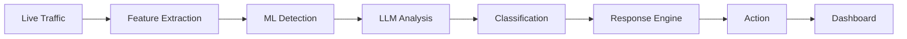
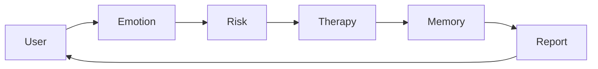
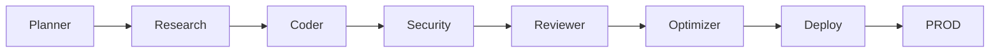

Here's the raw, copy‑paste‑ready Markdown for your **AI Engineer OS v4.0 – 3D Cyberpunk Edition** profile.  
Just copy the entire block below and paste it into your profile `README.md` – all the neon SVGs, Mermaid diagrams, and animated terminals will render beautifully on GitHub.

```markdown
<!--
  ╔══════════════════════════════════════════════════════════════════╗
  ║  AI ENGINEER OS v4.0  ·  GAME HUD EDITION                       ║
  ║  Render Engine: 3D CSS + SVG  ·  Theme: NEON CYBERPUNK          ║
  ╚══════════════════════════════════════════════════════════════════╝
-->

<div align="center">

<!-- ========== 3D HOLOGRAPHIC SPHERE + SYSTEM TITLE ========== -->
<br>
<svg width="100%" height="300" viewBox="0 0 900 300" xmlns="http://www.w3.org/2000/svg">
  <defs>
    <filter id="glow" x="-50%" y="-50%" width="200%" height="200%">
      <feGaussianBlur in="SourceGraphic" stdDeviation="8" result="blur" />
      <feMerge><feMergeNode in="blur" /><feMergeNode in="SourceGraphic" /></feMerge>
    </filter>
    <linearGradient id="titleGrad" x1="0%" y1="0%" x2="100%" y2="100%">
      <stop offset="0%" stop-color="#00ff9d" />
      <stop offset="50%" stop-color="#1e1b4b" />
      <stop offset="100%" stop-color="#00ff9d" />
    </linearGradient>
    <radialGradient id="sphereGrad" cx="50%" cy="50%" r="50%">
      <stop offset="0%" stop-color="#00ff9d" stop-opacity="0.4" />
      <stop offset="100%" stop-color="#0f172a" stop-opacity="0" />
    </radialGradient>
    <!-- 3D perspective transform -->
    <g id="hologram">
      <!-- rotating wireframe icosahedron projection -->
      <g>
        <animateTransform attributeName="transform" type="rotate" from="0 450 150" to="360 450 150" dur="20s" repeatCount="indefinite" />
        <!-- Front face -->
        <polygon points="400,50 500,50 550,130 450,180 350,130" fill="none" stroke="#00ff9d" stroke-width="1.5" opacity="0.8" />
        <polygon points="350,130 450,180 400,250 300,200" fill="none" stroke="#00ff9d" stroke-width="1.2" opacity="0.6" />
        <polygon points="450,180 550,130 500,250 400,250" fill="none" stroke="#00ff9d" stroke-width="1.2" opacity="0.6" />
        <polygon points="400,50 350,130 300,80" fill="none" stroke="#00ff9d" stroke-width="1.2" opacity="0.5" />
        <polygon points="500,50 550,130 600,80" fill="none" stroke="#00ff9d" stroke-width="1.2" opacity="0.5" />
        <!-- Back nodes -->
        <circle cx="450" cy="100" r="3" fill="#00ff9d" opacity="0.9" />
        <circle cx="400" cy="80" r="2" fill="#00ff9d" opacity="0.6" />
        <circle cx="500" cy="80" r="2" fill="#00ff9d" opacity="0.6" />
        <circle cx="480" cy="160" r="2" fill="#00ff9d" opacity="0.6" />
        <circle cx="380" cy="190" r="2" fill="#00ff9d" opacity="0.6" />
      </g>
      <!-- floating particles -->
      <circle cx="300" cy="100" r="1.5" fill="#00ff9d" opacity="0.6">
        <animate attributeName="cy" values="100;80;100" dur="3s" repeatCount="indefinite" />
      </circle>
      <circle cx="600" cy="180" r="1.5" fill="#00ff9d" opacity="0.6">
        <animate attributeName="cy" values="180;200;180" dur="2.5s" repeatCount="indefinite" />
      </circle>
      <circle cx="450" cy="220" r="2" fill="#00ff9d" opacity="0.5">
        <animate attributeName="cy" values="220;200;220" dur="4s" repeatCount="indefinite" />
      </circle>
    </g>
  </defs>
  <rect width="900" height="300" fill="#0a0a14" />
  <!-- Background grid -->
  <g opacity="0.1">
    <line x1="0" y1="100" x2="900" y2="100" stroke="#00ff9d" stroke-width="0.5" />
    <line x1="0" y1="200" x2="900" y2="200" stroke="#00ff9d" stroke-width="0.5" />
    <line x1="300" y1="0" x2="300" y2="300" stroke="#00ff9d" stroke-width="0.5" />
    <line x1="600" y1="0" x2="600" y2="300" stroke="#00ff9d" stroke-width="0.5" />
  </g>
  <!-- Hologram -->
  <use href="#hologram" x="0" y="0" />
  <!-- Title text with glitch effect -->
  <text x="450" y="85" font-family="'Fira Code', monospace" font-size="48" font-weight="bold" fill="url(#titleGrad)" text-anchor="middle" filter="url(#glow)">
    AI ENGINEER OS
  </text>
  <text x="450" y="120" font-family="'Fira Code', monospace" font-size="16" fill="#00ff9d" text-anchor="middle" opacity="0.8">
    KARTHIKEYAN S | AI/ML · GenAI · Agentic Systems
  </text>
  <!-- system status bar -->
  <rect x="250" y="240" width="400" height="20" rx="3" fill="none" stroke="#00ff9d" stroke-width="1" opacity="0.5" />
  <rect x="250" y="240" width="280" height="20" rx="3" fill="#00ff9d" opacity="0.2">
    <animate attributeName="width" values="280;400;280" dur="5s" repeatCount="indefinite" />
  </rect>
  <text x="450" y="255" font-family="'Fira Code', monospace" font-size="10" fill="#00ff9d" text-anchor="middle">SYSTEM ONLINE · NEURAL LINK ACTIVE</text>
</svg>

<br>

<!-- Animated Console Typing -->
<a href="https://github.com/skarthi369">
  
</a>

<br/>


[](https://linkedin.com/in/karthikeyan-s)
[](mailto:karthikeyan123401@gmail.com)
[](#)

</div>

<br/>

```
┌──────────────────────────────────────────────────────────────────────────────┐
│  root@karthikeyan:~$ whoami                                                  │
│  > B.Tech AI & Data Science | 1+ yr shipping ML/DL/CV/NLP + GenAI            │
│  > Published researcher (ICACT 2026) | 3x Hackathon Winner                    │
│  > Currently: Generative AI Research Intern @ CDAC                           │
│  > STATUS: <span style="color:#00ff9d">●</span> ACTIVE                                                              │
└──────────────────────────────────────────────────────────────────────────────┘
```

<br/>

## `[ NAVIGATION MATRIX ]`

<div align="center">

| `[ABOUT]` | `[MISSION]` | `[STACK]` | `[PROJECTS]` | `[ARCH]` | `[EXPERIENCE]` | `[RESEARCH]` | `[ACHIEVEMENTS]` | `[CONTACT]` |
|:---:|:---:|:---:|:---:|:---:|:---:|:---:|:---:|:---:|
| [↓](#-about) | [↓](#-live-mission) | [↓](#-tech-stack) | [↓](#-projects) | [↓](#-architecture-explorer) | [↓](#-experience-log) | [↓](#-research) | [↓](#-achievements) | [↓](#-contact) |

</div>

---

## `[ ABOUT ]` <span style="color:#00ff9d; font-size:14px;">▶ CLASSIFIED</span>

<div style="padding: 15px; background: #0a0a14; border: 1px solid #00ff9d; border-radius: 8px; box-shadow: 0 0 15px rgba(0,255,157,0.15); margin-bottom: 20px;">
  <p style="color:#8892b0; font-family: 'Fira Code', monospace; line-height: 1.6;">
    I engineer autonomous AI systems where <span style="color:#00ff9d">LLMs, deep learning pipelines & multi-agent swarms</span> make real-time, tactical decisions — from a self-learning intrusion firewall to a locally‑hosted, privacy‑preserving mental wellness AI. My realm lies at the bleeding edge of <span style="color:#00ff9d">Generative AI engineering</span> and applied ML, shipped end‑to‑end: data → model → API → hardened deployment.
  </p>

```yaml
engineer:
  callsign: "Karthikeyan S"
  languages: [Python, TypeScript, JavaScript, Java]
  core_domains: [Generative AI, Agentic Systems, Computer Vision, NLP, Cybersecurity AI]
  current_deployment: "Autonomous AI Firewall — LLM‑assisted IDS/IPS"
  publication: "EDITH — ICACT 2026 (Presented & Accepted)"
  threat_level: <span style="color:#00ff9d">●●●●○</span>
```
</div>

<br/>

## `[ LIVE MISSION ]` <span style="color:#00ff9d; font-size:14px;">▶ OPERATIONAL</span>

<div align="center" style="background:#0a0a14; border:1px solid #00ff9d; padding:15px; border-radius:8px; margin:10px 0;">

```
━━━━━━━━━━━━━━━━━━━━━━━━━━━━━━━━━━━━━━━━━━━━━━━━━━━━━━━━━━
  MISSION STATUS : ACTIVE
  OBJECTIVE ...... Autonomous AI Firewall (LLM‑Assisted IDS/IPS)
  ROLE ........... Generative AI Research Intern @ CDAC
  PROGRESS ....... ████████████████░░░░  78%
  CURRENT TASK ... LangGraph · MCP · RAG optimization · Agentic memory
  UPLINK ......... <span style="color:#00ff9d">●●● STABLE</span>
━━━━━━━━━━━━━━━━━━━━━━━━━━━━━━━━━━━━━━━━━━━━━━━━━━━━━━━━━━
```

</div>

<br/>

## `[ TECH STACK ]` <span style="color:#00ff9d; font-size:14px;">▶ ARSENAL</span>

<div align="center" style="margin-top:15px;">

**Languages**  


**AI / ML / GenAI**  


**Backend / Infra**  


**Frontend & Tools**  


</div>

<br/>

## `[ AI BRAIN MAP ]` <span style="color:#00ff9d; font-size:14px;">▶ 3D TACTICAL VIEW</span>

<div align="center">

<!-- Isometric 3D network diagram using pure SVG -->
<svg width="720" height="400" viewBox="0 0 800 400" xmlns="http://www.w3.org/2000/svg">
  <defs>
    <filter id="nodeGlow"><feGaussianBlur stdDeviation="3" result="blur" /><feMerge><feMergeNode in="blur"/><feMergeNode in="SourceGraphic"/></feMerge></filter>
    <linearGradient id="lineGrad" x1="0%" y1="0%" x2="100%" y2="100%"><stop offset="0%" stop-color="#00ff9d" stop-opacity="0.8"/><stop offset="100%" stop-color="#1e1b4b" stop-opacity="0.4"/></linearGradient>
  </defs>
  <rect width="800" height="400" fill="#0a0a14" rx="10" />
  <!-- grid lines -->
  <g stroke="#00ff9d" stroke-width="0.3" opacity="0.15">
    <line x1="0" y1="133" x2="800" y2="133" />
    <line x1="0" y1="266" x2="800" y2="266" />
    <line x1="266" y1="0" x2="266" y2="400" />
    <line x1="533" y1="0" x2="533" y2="400" />
  </g>
  <!-- Central AI node -->
  <circle cx="400" cy="200" r="25" fill="#0f172a" stroke="#00ff9d" stroke-width="2.5" filter="url(#nodeGlow)" />
  <text x="400" y="210" font-family="'Fira Code'" font-size="9" fill="#00ff9d" text-anchor="middle" font-weight="bold">AI</text>
  <text x="400" y="222" font-family="'Fira Code'" font-size="7" fill="#00ff9d" text-anchor="middle">ENGINE</text>
  <!-- Node clusters -->
  <!-- GenAI -->
  <circle cx="180" cy="100" r="16" fill="#0f172a" stroke="#00ff9d" stroke-width="1.5" />
  <text x="180" y="105" font-family="'Fira Code'" font-size="7" fill="#00ff9d" text-anchor="middle">GenAI</text>
  <line x1="200" y1="105" x2="375" y2="190" stroke="url(#lineGrad)" stroke-width="1.5" />
  <!-- CV -->
  <circle cx="620" cy="100" r="16" fill="#0f172a" stroke="#00ff9d" stroke-width="1.5" />
  <text x="620" y="105" font-family="'Fira Code'" font-size="7" fill="#00ff9d" text-anchor="middle">CV</text>
  <line x1="600" y1="105" x2="425" y2="190" stroke="url(#lineGrad)" stroke-width="1.5" />
  <!-- Cybersecurity -->
  <circle cx="180" cy="300" r="16" fill="#0f172a" stroke="#00ff9d" stroke-width="1.5" />
  <text x="180" y="305" font-family="'Fira Code'" font-size="7" fill="#00ff9d" text-anchor="middle">CySec</text>
  <line x1="200" y1="295" x2="375" y2="210" stroke="url(#lineGrad)" stroke-width="1.5" />
  <!-- Agents -->
  <circle cx="620" cy="300" r="16" fill="#0f172a" stroke="#00ff9d" stroke-width="1.5" />
  <text x="620" y="305" font-family="'Fira Code'" font-size="7" fill="#00ff9d" text-anchor="middle">Agents</text>
  <line x1="600" y1="295" x2="425" y2="210" stroke="url(#lineGrad)" stroke-width="1.5" />
  <!-- Sub-nodes (smaller) -->
  <!-- GenAI sub -->
  <circle cx="120" cy="60" r="10" fill="#0f172a" stroke="#00ff9d" stroke-width="1" />
  <text x="120" y="63" font-family="'Fira Code'" font-size="6" fill="#00ff9d" text-anchor="middle">RAG</text>
  <line x1="135" y1="65" x2="170" y2="95" stroke="#00ff9d" stroke-width="0.8" opacity="0.8"/>
  <circle cx="240" cy="60" r="10" fill="#0f172a" stroke="#00ff9d" stroke-width="1" />
  <text x="240" y="63" font-family="'Fira Code'" font-size="6" fill="#00ff9d" text-anchor="middle">LangG</text>
  <line x1="225" y1="65" x2="190" y2="95" stroke="#00ff9d" stroke-width="0.8" opacity="0.8"/>
  <!-- CV sub -->
  <circle cx="560" cy="60" r="10" fill="#0f172a" stroke="#00ff9d" stroke-width="1" />
  <text x="560" y="63" font-family="'Fira Code'" font-size="6" fill="#00ff9d" text-anchor="middle">CNN</text>
  <line x1="575" y1="65" x2="610" y2="95" stroke="#00ff9d" stroke-width="0.8" opacity="0.8"/>
  <circle cx="680" cy="60" r="10" fill="#0f172a" stroke="#00ff9d" stroke-width="1" />
  <text x="680" y="63" font-family="'Fira Code'" font-size="6" fill="#00ff9d" text-anchor="middle">OCV</text>
  <line x1="665" y1="65" x2="630" y2="95" stroke="#00ff9d" stroke-width="0.8" opacity="0.8"/>
  <!-- CySec sub -->
  <circle cx="120" cy="340" r="10" fill="#0f172a" stroke="#00ff9d" stroke-width="1" />
  <text x="120" y="343" font-family="'Fira Code'" font-size="6" fill="#00ff9d" text-anchor="middle">IDS</text>
  <line x1="135" y1="335" x2="170" y2="305" stroke="#00ff9d" stroke-width="0.8" opacity="0.8"/>
  <circle cx="240" cy="340" r="10" fill="#0f172a" stroke="#00ff9d" stroke-width="1" />
  <text x="240" y="343" font-family="'Fira Code'" font-size="6" fill="#00ff9d" text-anchor="middle">Phish</text>
  <line x1="225" y1="335" x2="190" y2="305" stroke="#00ff9d" stroke-width="0.8" opacity="0.8"/>
  <!-- Agents sub -->
  <circle cx="560" cy="340" r="10" fill="#0f172a" stroke="#00ff9d" stroke-width="1" />
  <text x="560" y="343" font-family="'Fira Code'" font-size="6" fill="#00ff9d" text-anchor="middle">Orch</text>
  <line x1="575" y1="335" x2="610" y2="305" stroke="#00ff9d" stroke-width="0.8" opacity="0.8"/>
  <circle cx="680" cy="340" r="10" fill="#0f172a" stroke="#00ff9d" stroke-width="1" />
  <text x="680" y="343" font-family="'Fira Code'" font-size="6" fill="#00ff9d" text-anchor="middle">Mem</text>
  <line x1="665" y1="335" x2="630" y2="305" stroke="#00ff9d" stroke-width="0.8" opacity="0.8"/>
  <!-- Legend -->
  <rect x="10" y="370" width="10" height="10" fill="#0f172a" stroke="#00ff9d" />
  <text x="25" y="380" font-family="'Fira Code'" font-size="7" fill="#8892b0">Production-Ready</text>
</svg>

</div>

<br/>

## `[ PROJECTS ]` <span style="color:#00ff9d; font-size:14px;">▶ DEPLOYED SYSTEMS</span>

<details open>
<summary style="color:#00ff9d; font-weight:bold; font-size:16px;">🛡️ AI FIREWALL — LLM‑POWERED IDS/IPS</summary>
<br/>

`Python` `LLMs` `Docker` `Embeddings` `REST APIs` `Cybersecurity AI`

<div style="padding:10px; background:#0a0a14; border:1px solid #00ff9d55; border-radius:8px;">
Autonomous intrusion detection & prevention system exposed via hardened REST APIs. Combines classic ML detection with LLM‑driven semantic threat analysis, containerized for one‑click deployment.
</div>



</details>

<details>
<summary style="color:#00ff9d; font-weight:bold; font-size:16px;">🎭 DEEPFAKE DETECTION — CNN‑TRANSFORMER HYBRID</summary>
<br/>

`TensorFlow` `CNN` `Transformers` `OpenCV` `Computer Vision`

<div style="padding:10px; background:#0a0a14; border:1px solid #00ff9d55; border-radius:8px;">
10‑layer deep CNN (653K+ params) with ~88% validation accuracy. Augmented by Transformer‑based feature extraction and OpenCV preprocessing pipeline.
</div>

</details>

<details>
<summary style="color:#00ff9d; font-weight:bold; font-size:16px;">🧠 MINDFULCHAT — EMOTION‑AWARE AI ASSISTANT</summary>
<br/>

`React` `TypeScript` `Ollama` `Gemma 4` `NLP`

<div style="padding:10px; background:#0a0a14; border:1px solid #00ff9d55; border-radius:8px;">
Locally hosted, privacy‑first mental wellness chatbot with a 5‑agent architecture: Emotion → Risk → Therapy → Memory → Report. Real‑time sentiment analysis & support.
</div>



</details>

<details>
<summary style="color:#00ff9d; font-weight:bold; font-size:16px;">🎣 PHISHING URL DETECTION PLATFORM</summary>
<br/>

`Python` `Streamlit` `Scikit-Learn` `WHOIS` `SSL`

<div style="padding:10px; background:#0a0a14; border:1px solid #00ff9d55; border-radius:8px;">
ML‑powered detector with Shannon entropy, redirect chain analysis, SSL validation, and brand‑impersonation heuristics. Production‑grade scoring engine.
</div>

</details>

<details>
<summary style="color:#00ff9d; font-weight:bold; font-size:16px;">🌦️ AGENTIC WEATHER PREDICTION SYSTEM</summary>
<br/>

`Python` `Streamlit` `LSTM` `RNN` `Graph Neural Networks`

<div style="padding:10px; background:#0a0a14; border:1px solid #00ff9d55; border-radius:8px;">
LSTM/RNN/GNN ensemble with reinforcement learning to adapt from real‑time satellite + weather station streams. Autonomously retrains on new data.
</div>

</details>

<details>
<summary style="color:#00ff9d; font-weight:bold; font-size:16px;">🤖 MULTI‑AGENT ORCHESTRATION FRAMEWORK</summary>
<br/>

`Python` `AsyncIO` `LangGraph`

<div style="padding:10px; background:#0a0a14; border:1px solid #00ff9d55; border-radius:8px;">
Planner → Researcher → Coder → Security → Reviewer → Optimizer → Deployment. Dynamic routing, state persistence, checkpoint recovery.
</div>



</details>

<br/>

## `[ EXPERIENCE LOG ]` <span style="color:#00ff9d; font-size:14px;">▶ MISSION ARCHIVE</span>

<div style="position:relative; text-align:center; margin:20px 0;">
<svg width="700" height="180" viewBox="0 0 700 180" xmlns="http://www.w3.org/2000/svg">
  <defs>
    <linearGradient id="expLine" x1="0%" y1="0%" x2="100%" y2="0%"><stop offset="0%" stop-color="#00ff9d"/><stop offset="100%" stop-color="#1e1b4b"/></linearGradient>
  </defs>
  <rect width="700" height="180" fill="#0a0a14" rx="8" />
  <!-- timeline base -->
  <line x1="30" y1="90" x2="670" y2="90" stroke="url(#expLine)" stroke-width="3" />
  <!-- nodes & labels -->
  <circle cx="120" cy="90" r="6" fill="#00ff9d" /><text x="120" y="75" font-family="'Fira Code'" font-size="8" fill="#00ff9d" text-anchor="middle">2024</text><text x="120" y="115" font-family="'Fira Code'" font-size="7" fill="#8892b0" text-anchor="middle">CED / Resolute AI</text>
  <circle cx="320" cy="90" r="6" fill="#00ff9d" /><text x="320" y="75" font-family="'Fira Code'" font-size="8" fill="#00ff9d" text-anchor="middle">2025</text><text x="320" y="115" font-family="'Fira Code'" font-size="7" fill="#8892b0" text-anchor="middle">Microsoft · CDAC</text>
  <circle cx="520" cy="90" r="6" fill="#00ff9d" /><text x="520" y="75" font-family="'Fira Code'" font-size="8" fill="#00ff9d" text-anchor="middle">2026</text><text x="520" y="115" font-family="'Fira Code'" font-size="7" fill="#8892b0" text-anchor="middle">ICACT Publication</text>
  <!-- decorative dots -->
  <circle cx="200" cy="90" r="2" fill="#00ff9d" opacity="0.5"/><circle cx="280" cy="90" r="2" fill="#00ff9d" opacity="0.5"/><circle cx="400" cy="90" r="2" fill="#00ff9d" opacity="0.5"/><circle cx="460" cy="90" r="2" fill="#00ff9d" opacity="0.5"/>
</svg>
<br>
<span style="color:#00ff9d; font-family:'Fira Code'; font-size:14px;">▶ CURRENT ASSIGNMENT: GEN AI RESEARCH INTERN @ CDAC (ACTIVE)</span>
</div>

<br/>

## `[ RESEARCH ]` <span style="color:#00ff9d; font-size:14px;">▶ CLASSIFIED</span>

<div style="padding:15px; background:#0a0a14; border:1px solid #00ff9d55; border-radius:8px;">
**EDITH: Enhanced Daily Interaction and Therapeutic Hardware for Paralysis Patient Support**  
*ICACT 2026 International Conference — Accepted & Presented*  
AI‑assisted modular robotics platform integrating biosignal monitoring, mobility assistance, rehabilitation support, and a Brain‑Computer Interface (BCI) pathway.  
<span style="color:#00ff9d">[Publication Link Coming Soon]</span>
</div>

<br/>

## `[ ACHIEVEMENTS ]` <span style="color:#00ff9d; font-size:14px;">▶ TROPHY ROOM</span>

<div align="center">
<table style="background:#0a0a14; border:1px solid #00ff9d55;">
  <tr>
    <td align="center" style="padding:10px;">🏆 <b>Winner</b><br/><span style="color:#8892b0;font-size:12px;">Hexaware 36‑H Hackathon (Enterprise AI)</span></td>
    <td align="center" style="padding:10px;">🏆 <b>Winner</b><br/><span style="color:#8892b0;font-size:12px;">Prompt‑o‑Mania (GenAI Track)</span></td>
    <td align="center" style="padding:10px;">🏆 <b>Winner</b><br/><span style="color:#8892b0;font-size:12px;">Sparathon: Semantic Understanding & Fine‑Tuning</span></td>
  </tr>
</table>
</div>

**Certifications:** Google & Kaggle 5‑Day AI Agents Intensive · Microsoft & Edunet Foundations of AI · Informatica Data Engineering Foundation · Udemy Git & GitHub · Infosys Applied Generative AI

<br/>

## `[ SYSTEM TELEMETRY ]` <span style="color:#00ff9d; font-size:14px;">▶ LIVE FEED</span>

<div align="center">


</div>

<br/>

## `[ ESTABLISH UPLINK ]` <span style="color:#00ff9d; font-size:14px;">▶ COMMS OPEN</span>

<div align="center">

[](mailto:karthikeyan123401@gmail.com)
[](https://linkedin.com/in/karthikeyan-s)
[](https://github.com/skarthi369)

<br/>

```
> system.status  = "OPEN TO OPPORTUNITIES"
> response_time  = "< 24h"
> handshake      = "ESTABLISHED"
```

<svg width="100%" height="120" viewBox="0 0 900 120" preserveAspectRatio="none" xmlns="http://www.w3.org/2000/svg">
  <defs>
    <linearGradient id="footerGrad" x1="0%" y1="0%" x2="100%" y2="0%">
      <stop offset="0%" stop-color="#0a0a14" />
      <stop offset="50%" stop-color="#1e1b4b" />
      <stop offset="100%" stop-color="#0a0a14" />
    </linearGradient>
  </defs>
  <rect width="900" height="120" fill="url(#footerGrad)" />
  <path d="M0,40 Q225,0 450,40 T900,20 L900,120 L0,120 Z" fill="#0a0a14" opacity="0.8"/>
  <text x="450" y="80" font-family="'Fira Code', monospace" font-size="14" fill="#00ff9d" text-anchor="middle" opacity="0.6">// END OF LINE //</text>
</svg>

</div>
```
